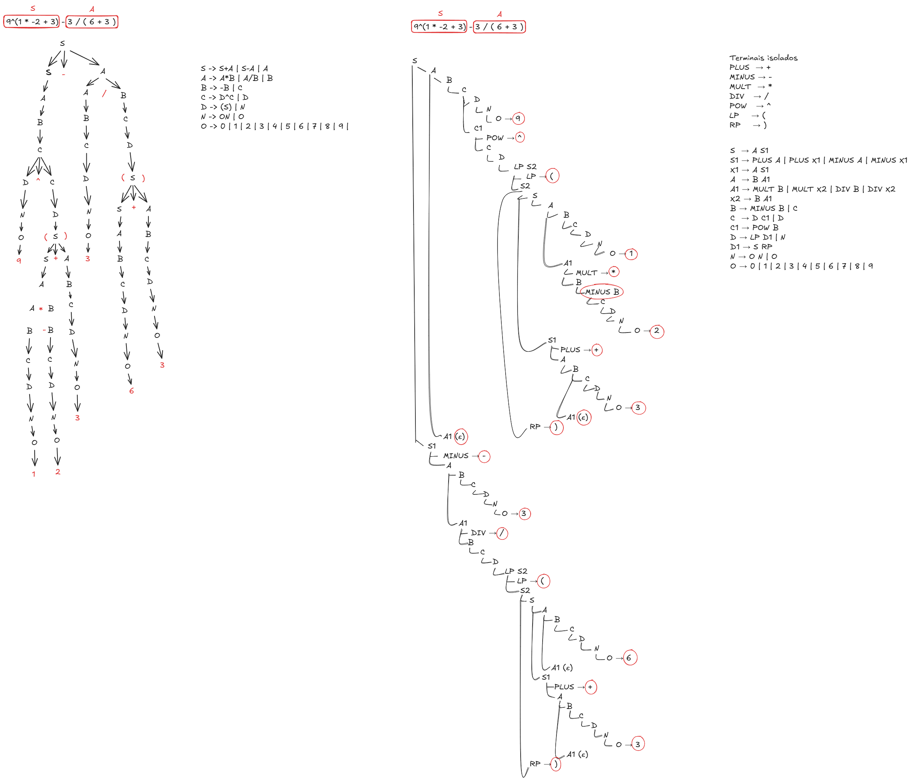

# Regras da Gramática - Algoritmo de Earley

As regras abaixo definem a estrutura das expressões aritméticas suportadas pelo analisador de Earley:

```bnf
S -> S + A | S - A | A
A -> A * B | A / B | B
B -> - B | C
C -> D ^ B | D
D -> ( S ) | N
N -> O N | O
O -> 0 | 1 | 2 | 3 | 4 | 5 | 6 | 7 | 8 | 9
```


